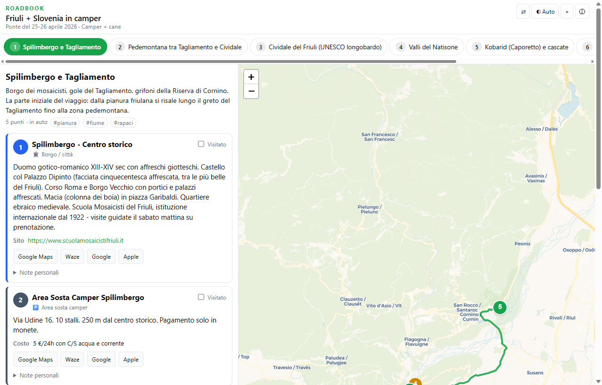
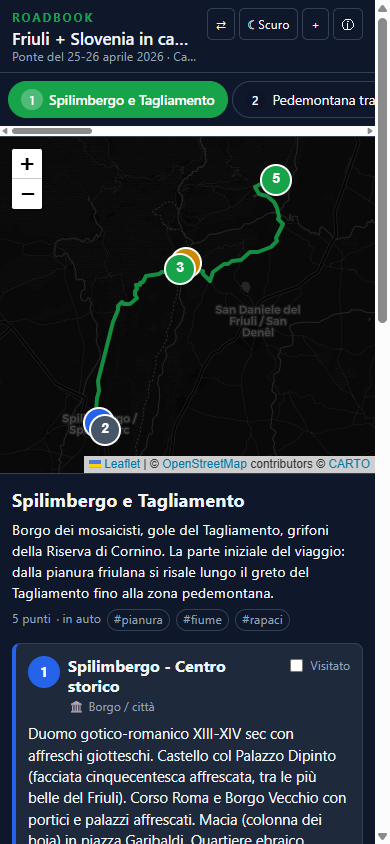

# Roadbook

[](#stato-del-progetto)
[](https://vuejs.org/)
[](https://vitejs.dev/)
[](https://leafletjs.com/)
[](https://web.dev/progressive-web-apps/)
[](https://AldebaranPrimo.github.io/roadbook/)

> ⚠ **Versione 1.0 — beta iniziale.** Tutte le funzionalità "must" sono implementate e verificate con test visuali, ma è comunque un primo rilascio destinato all'uso diretto e al feedback. Rotture di schema, piccole regressioni di UI e cambi di formato sono ancora possibili. Segnalare problemi e suggerimenti aprendo una issue.

## 🚀 Provala subito

**→ [https://AldebaranPrimo.github.io/roadbook/](https://AldebaranPrimo.github.io/roadbook/) ←**

Al primo accesso viene caricato automaticamente un viaggio di esempio (ponte 25-26 aprile 2026, Friuli + Slovenia in camper: 7 aree, 30 punti). Da lì puoi esplorare mappa, tab delle aree, popup sui marker, stato "visitato" e note personali. Per caricare un tuo itinerario: bottone **+** nell'header (drag & drop di un JSON, file picker o URL).

Installabile come app su Android e iOS: **Condividi → Aggiungi a schermata Home** (iOS) / **⋮ → Installa app** (Chrome Android).

---

**Roadbook** è una Progressive Web App per consultare itinerari di viaggio da file JSON, online e offline. È pensata per l'uso in viaggio, da telefono, spesso in zone con connessione scarsa o assente.

Caricato un JSON con l'itinerario, l'app mostra:

- le **aree geografiche** come tab navigabili,
- per ogni area una **mappa interattiva** con marker numerati colorati per categoria e il **percorso reale** calcolato su OSRM,
- una **lista descrittiva** ricca dei punti (orari, costi, avvertenze, foto, deep link a Google Maps / Waze / Apple Maps / OSMAnd),
- **note personali** per punto, **stato "visitato"**, **tema chiaro/scuro/auto**,
- tutto **persistito localmente in IndexedDB**, disponibile **offline dopo la prima apertura**.

---

## Anteprima

### Desktop

Layout a due colonne (lista + mappa), tab delle aree scrollabili, marker numerati colorati per categoria, polyline verde = percorso reale calcolato da OSRM.



### Mobile

Layout responsive: mappa compatta (~40% dell'altezza) sopra, lista scorrevole sotto, tab delle aree scrollabili orizzontalmente. Tema scuro, sync bidirezionale mappa ↔ lista, cache del routing OSRM in IndexedDB e tutti i comportamenti offline sono più facili da vedere dal vivo sul [sito live](https://AldebaranPrimo.github.io/roadbook/).

<p>
  
</p>

---

## Stato del progetto

**Versione corrente: 1.0 — beta iniziale** (24 aprile 2026).

Questo è il primo rilascio pubblico: è *funzionalmente* completo rispetto al perimetro della v1 (vedi sotto) e ha superato una batteria di test visuali con Playwright su desktop, mobile e con la rete OSRM disattivata, ma:

- Lo **schema JSON** è versionato (`$schema_version: "1.0"`) e potrebbe subire piccoli aggiustamenti in v1.x se emergono esigenze non previste.
- L'app si aspetta di girare sul path `/roadbook/` (GitHub Pages). In ambienti alternativi vanno aggiornati `base` in `vite.config.js` e `start_url`/`scope` del manifest.
- **Nessun meccanismo di sync cloud** ancora: tutto è locale al dispositivo (IndexedDB). È in roadmap per la v2.
- Le **icone PWA** sono ancora placeholder SVG; per installabilità Android al 100% vanno sostituite con PNG 192/512/maskable.

Stato dettagliato: [`docs/STATO-PROGETTO.md`](docs/STATO-PROGETTO.md). Cronologia modifiche: [`docs/CHANGELOG.md`](docs/CHANGELOG.md). Cose da fare: [`docs/TODO.md`](docs/TODO.md).

## Funzionalità v1

- ✅ Caricamento viaggio da **file picker**, **drag & drop**, o **URL** (parametro `?viaggio=https://…`)
- ✅ **Validazione** schema JSON con messaggi chiari in italiano, errori **e** avvisi separati
- ✅ Forward-compatibility: campi sconosciuti (`giorni`, `gpx_url`, `bookings`, `meteo_link`…) ignorati silenziosamente
- ✅ **Auto-scoperta** del primo viaggio di esempio alla prima apertura: nessun viaggio hardcoded nel codice
- ✅ Scelta tra viaggi multipli se in storage ce ne sono più di uno
- ✅ **Mappa Leaflet** con tile CartoDB Voyager/Dark, marker `L.divIcon` numerati e colorati per categoria, popup con "Dettagli → lista"
- ✅ Percorso reale via **OSRM pubblico** (driving o foot in base a `area.modalita`), timeout 5s, fallback polyline retta, **cache persistente senza scadenza applicativa** in IndexedDB
- ✅ Bottone "Ricalcola percorso area" per forzare aggiornamento dell'OSRM (utile quando cambia la composizione dei punti)
- ✅ **Sync bidirezionale** lista ↔ mappa: fly-to dal click sulla scheda, scroll alla scheda dal click sul marker
- ✅ **Stato "visitato"** per punto con testo barrato + opacità, **note personali** per punto con auto-save
- ✅ Deep link a **Google Maps**, **Waze**, **Apple Maps**, mappe native dell'OS rilevato (Apple su iOS/Mac, Google altrove)
- ✅ Tema chiaro / scuro / auto, persistito tra sessioni
- ✅ **Stampa** nativa del browser: `@media print` nasconde mappa, controlli, azioni; lista linearizzata, page-break dentro le schede evitato
- ✅ **Backup**: esporta tutto (viaggi + visitati + note + routing cache + preferenze) come JSON, e reimporta
- ✅ **PWA installabile**: manifest, service worker Workbox, runtime caching tile CartoDB (CacheFirst 30gg, max 3000 tile) e OSRM (NetworkFirst 5s)

Le funzionalità "nice to have" della v2 (filtri per categoria/tag, ricerca testuale, geolocalizzazione, sync cloud per-utente) sono documentate nelle [specifiche](docs/SPECIFICHE-APP.md#42-funzionalità-nice-to-have-v2) e nel [`STATO-PROGETTO.md`](STATO-PROGETTO.md).

---

## Quick start

```bash
npm install
npm run dev            # http://localhost:5173/roadbook/  (senza service worker)
npm run build          # produce dist/
npm run preview        # http://localhost:4173/roadbook/  (con service worker attivo)
```

> **Nota**: il service worker è disabilitato in dev (`devOptions.enabled: false` in `vite.config.js`). Per testare la PWA vera — offline, installabilità, cache — bisogna usare `npm run build` + `npm run preview`.

### Aggiungere un viaggio di esempio bundled

1. Salvare il file JSON in `public/viaggi/`.
2. Il plugin Vite locale in `vite.config.js` rigenera automaticamente `public/viaggi/manifest.json` in dev (via middleware) e in build (via `writeBundle`). Al primo avvio con storage vuoto l'app prende il **primo** file elencato nel manifest come esempio iniziale.

Per caricare un viaggio al volo senza modificare il repo, basta usare "Carica viaggio" nell'header (drag & drop / file picker / URL).

---

## Schema del JSON di viaggio

Il JSON è la fonte unica di verità del viaggio: cambia il file, cambia l'app.

```json
{
  "$schema_version": "1.0",
  "viaggio": { "id": "slug-univoco", "titolo": "…", "sottotitolo": "…", "descrizione_estesa": "…" },
  "categorie": {
    "natura":   { "colore": "#16a34a", "label": "Natura", "icona_emoji": "🌳" },
    "castello": { "colore": "#9333ea", "label": "Castello", "icona_emoji": "🏰" }
  },
  "aree": [
    {
      "id": 1,
      "nome": "Spilimbergo e Tagliamento",
      "intro": "Borgo dei mosaicisti, gole del Tagliamento…",
      "modalita": "auto",
      "punti": [
        {
          "n": 1,
          "name": "Spilimbergo - Centro storico",
          "lat": 46.111223, "lon": 12.901674,
          "categoria": "citta",
          "desc": "…",
          "orari": "…", "costo": "…", "sito_web": "…", "avvertenze": "…"
        }
      ]
    }
  ]
}
```

Schema completo (tipi, obbligatori/opzionali, estensioni future): [`docs/SPECIFICHE-APP.md §3`](docs/SPECIFICHE-APP.md).

Un esempio reale con 7 aree / 30 punti: [`public/viaggi/viaggio-friuli-2026.json`](public/viaggi/viaggio-friuli-2026.json).

---

## Architettura

Tutto lo stato applicativo vive in **IndexedDB** via libreria [`idb`](https://www.npmjs.com/package/idb). I componenti non accedono mai direttamente allo storage: passano sempre dal wrapper `src/utils/store-viaggi.js`, che espone un'interfaccia pulita (liste, CRUD, backup/restore) pensata per essere affiancata o sostituita in futuro da un backend cloud per utente.

Object store IndexedDB:

| Store | Chiave | Contenuto |
|---|---|---|
| `viaggi` | `viaggio.id` | record completo del viaggio importato + metadati (origine, data import, dimensione) |
| `visitati` | `${viaggioId}:${areaId}-${n}` | flag "visitato" per punto |
| `note` | `${viaggioId}:${areaId}-${n}` | testo libero per punto |
| `routing` | `${viaggioId}:${areaId}` | geometria polyline encoded + modalità + timestamp |
| `preferenze` | chiave semantica (`tema`, …) | valore |

### Cache del routing OSRM

Il requisito più delicato del progetto: mostrare il percorso reale anche in zone senza connessione, ma solo **dopo che l'utente lo ha aperto almeno una volta online**.

Flusso in `src/utils/routing-osrm.js`:

1. All'apertura di un'area si tenta la lettura del routing dalla cache IndexedDB.
2. **Cache hit** → decodifica la polyline, disegna subito il percorso. Nessuna chiamata di rete.
3. **Cache miss** → chiama OSRM pubblico (`router.project-osrm.org`) con timeout 5s.
   - Successo: salva la geometria in IndexedDB, disegna il percorso reale.
   - Errore/timeout: disegna una polyline retta tratteggiata con banner "Percorso non ancora calcolato: riapri l'area online per calcolare il percorso reale".

La cache **non scade applicativamente**: sopravvive a settimane offline. L'utente può invalidarla manualmente dal modal Info ("Ricalcola percorso area").

### Struttura del repo

```
roadbook/
├── public/
│   ├── viaggi/                      file JSON degli itinerari (+ manifest.json autogenerato)
│   └── icons/                       icone PWA (SVG placeholder, da sostituire con PNG)
├── src/
│   ├── App.vue                      orchestratore: avvio, onboarding, routing UI
│   ├── main.js
│   ├── components/
│   │   ├── HeaderApp.vue            header + bottoni cambio/tema/carica/info
│   │   ├── AreaTabs.vue             tab scrollabili delle aree
│   │   ├── AreaPanel.vue            intro area + lista schede punto
│   │   ├── PuntoCard.vue            scheda punto (orari, costo, foto, link, check, note)
│   │   ├── MappaLeaflet.vue         mappa + marker + routing cached + sync
│   │   ├── ModalInfo.vue            info viaggio, avanzamento, legenda, azioni
│   │   ├── ModalCaricaViaggio.vue   file picker + drag&drop + URL
│   │   ├── OnboardingVuoto.vue      primo avvio senza viaggi
│   │   └── SelettoreViaggio.vue     scelta tra viaggi multipli
│   ├── composables/
│   │   ├── useTema.js               tema persistito
│   │   ├── useViaggio.js            viaggio + area correnti
│   │   ├── useViaggiLista.js        lista viaggi in storage + import/remove
│   │   ├── useVisitati.js           stato visitato
│   │   └── useNote.js               note personali
│   ├── utils/
│   │   ├── store-viaggi.js          wrapper IndexedDB (CRUD + backup/restore)
│   │   ├── valida-schema.js         validatore schema v1.0 (errori/avvisi in italiano)
│   │   ├── routing-osrm.js          OSRM + decoder polyline5 + cache + fallback
│   │   ├── mappe-esterne.js         deep link Google/Waze/Apple con rilevamento OS
│   │   └── esempi.js                auto-discovery primo esempio
│   └── styles/
│       └── app.css                  variabili tema (chiaro/scuro/auto), base print
├── docs/
│   ├── SPECIFICHE-APP.md            specifiche complete (fonte di verità del prodotto)
│   └── screenshots/                 immagini di questo README
├── .github/workflows/deploy.yml     build + deploy su GitHub Pages al push su main
├── vite.config.js                   + plugin locale per auto-generare viaggi/manifest.json
├── STATO-PROGETTO.md                stato sviluppo, decisioni, gotcha, migliorie rinviate
└── README.md
```

---

## Deploy

Deploy automatico via GitHub Actions a ogni push su `main`, descritto in [`.github/workflows/deploy.yml`](.github/workflows/deploy.yml).

Prima dell'apertura al pubblico, in una tantum:

1. Creare il repo GitHub (già fatto: [`AldebaranPrimo/roadbook`](https://github.com/AldebaranPrimo/roadbook)).
2. *Settings → Pages → Build and deployment → Source: **GitHub Actions***.
3. Fare il primo push su `main` — il workflow esegue la build e pubblica `dist/` su Pages.

Sito live: **https://AldebaranPrimo.github.io/roadbook/**

`base: '/roadbook/'` in `vite.config.js` garantisce che tutti i path statici siano relativi al sottopath di Pages. Nel codice applicativo si usa `import.meta.env.BASE_URL` per costruire URL dinamici (manifest, fetch viaggi bundled).

---

## Tecnologie e scelte

| Ambito | Scelta | Perché |
|---|---|---|
| UI | **Vue 3** (Composition API + `<script setup>`) | reattività senza overhead, `.vue` single-file leggibili |
| Build | **Vite 6** | dev server fulmineo, build ottimizzata, plugin Vue |
| PWA | **vite-plugin-pwa** (Workbox) | manifest + SW + runtime caching dichiarativo |
| Mappe | **Leaflet 1.9** | maturo, leggero, ottime performance mobile |
| Routing | **OSRM pubblico** | gratuito, nessuna API key; cache applicativa risolve il "senza SLA" |
| Tile | **CartoDB** (Voyager / Dark) | funziona da qualsiasi origin, dark mode nativa, evita il problema `Referer` di OSM |
| Storage | **IndexedDB** via [`idb`](https://www.npmjs.com/package/idb) | niente limiti da 5 MB di localStorage, supporto naturale a blob JSON e routing cached |

Per i dettagli sul perché **non** ESRI (problema di proiezione), **non** Alpine (cambio rispetto alla prima versione delle specifiche), e la valutazione degli altri provider: [`docs/SPECIFICHE-APP.md §7`](docs/SPECIFICHE-APP.md).

---

## Documenti correlati

- **[`docs/STATO-PROGETTO.md`](docs/STATO-PROGETTO.md)** — snapshot dello stato attuale del sistema
- **[`docs/CHANGELOG.md`](docs/CHANGELOG.md)** — cronologia sintetica delle modifiche
- **[`docs/TODO.md`](docs/TODO.md)** — lista delle cose da fare
- **[`docs/SPECIFICHE-APP.md`](docs/SPECIFICHE-APP.md)** — specifiche complete v1.0 (schema JSON, funzionalità must/nice-to-have, roadmap sprint)
- **[`CLAUDE.md`](CLAUDE.md)** — contratto AI specifico di questo repo, e [`CLAUDE-vue-app.md`](CLAUDE-vue-app.md) — contratto AI generico per app Vue standalone

## Licenza

Codice personale, tutti i diritti riservati. Aprire una issue per domande o proposte.
